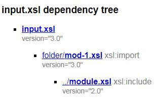

# xml-utilities
A set of XML utilities, like XSLT common tools etc.

### get-xml-file-static-dependency-tree.xsl

This XSLT takes any XML based input and generates an XML ouptut that shows all *static* XML dependencies (inclusions) as a tree:

```xml
<file name="input.xsl" abs-uri="file:/.../input.xsl" _version="3.0">
  <file dependency-type="xsl:import" name="mod-1.xsl" uri="folder/mod-1.xsl" abs-uri="file:/.../mod-1.xsl" _version="3.0">
    <file dependency-type="xsl:include" name="module.xsl" uri="../module.xsl" abs-uri="file:/.../module.xsl" _version="2.0"/>
  </file>
</file>
```
It aims at working with any kind of XML based files.

At the moment, it works with these kind of dependencies:

- xi:include
- XSLT
- XPROC
- W3C Schema
- Relax NG
- Schematron (1.5 and iso-schematron)
- NVDL

And of course it works all together (for example: an XPROC that loads an XSLT which contains an xi:include)

Please see the `test` directory to see examples.

The dependency tree is created by reading each file recursively. When an non-XML file is encountered (like an Relax NG compact Syntax or a DTD within a NVDL script) the recursion stops.

The XSLT is also able to output the result as an HTML file so it's more easy to read:



It's possible to add extra informations like the `version` attribute above, depending on each kind of file.

With both outputs (XML / HTML) it's possible to gather the content of each file (without duplication if a file is included several times):


> **CAUTION**: this XSLT only works with static dependencies declared in each XML files. 
> 
> For instance, if an XPROC script loads an XML file dynamicaly (by getting its uri with xpath) then the dependency won't be shown in the dependency tree.

This repo will probably be published as a Maven artefact soon. It includes a copy of functx.xsl today, but it could becomes a Maven dependency.
